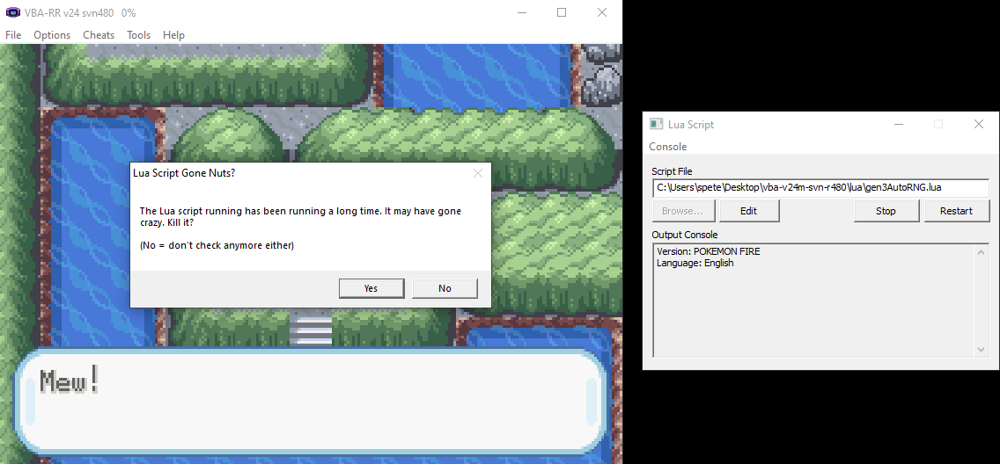
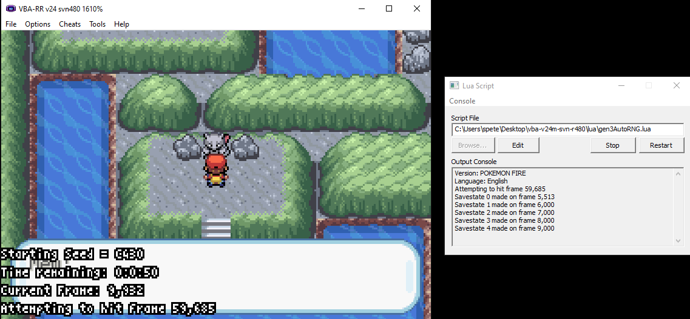
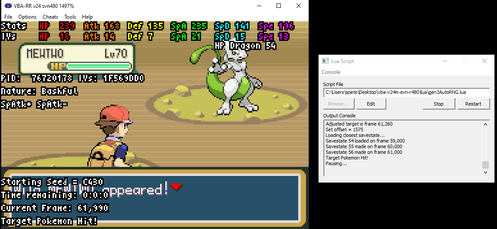

# pokemonGen3AutoRNG

This lua script can allow you to automatically RNG any Pokemon in a gen 3 Pokemon game. 

For instructions on how to do this manually, a good explanation of what is actually happening, and how to do much of the setting up, consult the following guide: https://projectpokemon.org/home/forums/topic/40187-tutorial-gen-3-emurng-tutorials-for-basic-methods/

Note that only method 1 Pokemon, static encounters, have been tested.

Steps to use the script:

1. Download a VBA-RR emulator.

2. Get the emulator working with your ROM and save game.

3. Place the lua script in the lua folder / directory where lua scripts are stored in your version.

4. Use RNGReporter to find the Pokemon you want to get. Note that this was built for RNGReporter 10.3.4. This may be incompatible with other versions based on how columns are ordered and output.
 - You will need PKHex to view data about your save file if you want to get shiny Pokemon and dont have any yet.
 - You will need to know the seed of the current RNG instance in the game. Unless you are somehow emulating a battery, Pokemon Emerald will have a seed of 0, Sapphire/Ruby will be 5A0, and FireRed/LeafGreen will generate one after "start" is pressed on the title screen. For FR/LG, consult the linked guide at the top under "other things to note". Note that for FR/LG this seed will change if you "turn off" the system. However, it will stay the same if you save that save state. Consequentially, it may be beneficial to reset the game and check every seed you encounter to look for good/early frame Pokemon in these seeds, making save states of ones you think are good.
  
5. Export only that pokemon's entry as a text file, naming it "target.txt". Place it in the same directory as the lua script.

6. Export the pokemon with surrounding entries as well. Make sure to leave a lot of extra room depending on the frame number of the target pokemon. The higher the frame number, the more room. For numbers < 100,000, leave +/- 10,000 entries. For numbers between 100,000 and 1,000,000, leave +/- 100,000 entries. For sufficiently large frame numbers, consider using +/- 2,000,000 entries. Name the file "1.txt", "h2.txt", or "h4.txt" depending on the method, and place it in the lua directory.

7. Start the game, and get to the moment right before the keypress that will trigger an encounter / trigger the Pokemon to be generated. Edit the top of the lua script.
 - isPartyPkmn: true if the Pokemon will be in your party (gift Pokemon like starter, beldum, and magikarp), false if wild encounter.
 - partyIndex: If status == 1, the location in the party where the Pokemon will appear. Can be 1-6.
 - method: 1 if method 1 Pokemon. Any other number otherwise. Make sure that your method's txt file is the only one in the directory!
 - button: 0 if "A" is to be pressed to trigger the encounter. For other integers, "Up" will be used.

8. Pause the game from the emulator and create your own manual save state (just in case something goes wrong :) ).

9. Run the lua script and unpause the emulator. You can make the game speed as fast as possible. Turbo mode is good for this.

10. Wait until the game pauses, showing the Pokemon. The script will calculate the estimated time until the desired frame is reached.

11. Make a sav estate, stop the lua script, and catch that Pokemon!

How it works: 
The script will progress until the desired frame. Meanwhile it is periodically making save states. The frequency of the save states depend on how large the desired frame is, and increases as it draws nearer. Once the desired frame is reached, the script inputs the trigger button to encounter the Pokemon. Then, the stats of the Pokemon are searched in the method text file to find the Pokemon that was found. If the Pokemon was not the desired one, the frame error is calculated (difference between frame of actual Pokemon and desired Pokemon) and a new target frame is created. The latest save state before this frame is then loaded. This process repeats until the desired Pokemon is achieved. Note that 0-3 reloads are expected. Once the desired Pokemon is reached, the game will pause and the Pokemon's stats will be displayed.

Troubleshooting:
- If the lua script fails to run completely, you may need to replace the dll files for lua that are in or above the lua directory.
- Re-read the above steps carefully. Look up manual RNG manipulation guides if you are confused about the overall process.
- Make sure that you are only one key press away from encountering the Pokemon. Sometimes this is calculated while talking to someone.
- Note that the frame error tends to increase as the current frame increases, and as the game clock increases. This may cause a very early frame to be unobtainable. You can try to fix this issue by changing the game clock in PKHex.
- The script will change the encoding of the text files so that they are compatible with lua. This was achieved by running powershell commands in the background. This may not work on your computer.

Pictures:

When the script is started a powershell window will open to change the encodings of the txt files. After this, the files are parsed and saved in variables. While this is occurring, the emulator will say that the script is taking a while to respond. Simply click "no" when it asks whether to kill it.

The GUI will display the current frame as well as the desired frame. An estimation of the time remaining is displayed in hh:mm:ss format. Note that this timer updates every 1000 frames which should be more than once per second in turbo mode. In the right box we can see the script making its internal save states. These are different from the ones that the player can make.

The right box displays the process of looking for which Pokemon was encountered and adjusting the target frame. The offset here is 1575 frames which gives a new target of frame 61,260. The save state on frame 59,000 is loaded. This readjustment process can take multiple times.

The script detects that the encountered Pokemon is the desired shiny Mewtwo! Its stats are displayed on screen and the emulator is paused.

TODO:

- Optimize savesatates algorithm
     - Memory efficiency (Number of saves)
     - Time efficiency (Frequency of saves)
- Test method 2 and 4 encounters

Credit:

- zaksabeast for the inspiration and basis for this script: https://github.com/zaksabeast/rngLuaScripts/blob/master/autoFrLgRNG.lua

- FractalFusion and Kaphotics for the base of this script. Their work on the hex locations and the pokemonstats script were vital.

- red-the-dev for his code that can detect the version of the game: https://github.com/red-the-dev/gen3-pokemonstatsdisplay

- http://stackoverflow.com/a/5032014 for string:split

- http://stackoverflow.com/a/21287623 for newAutotable
